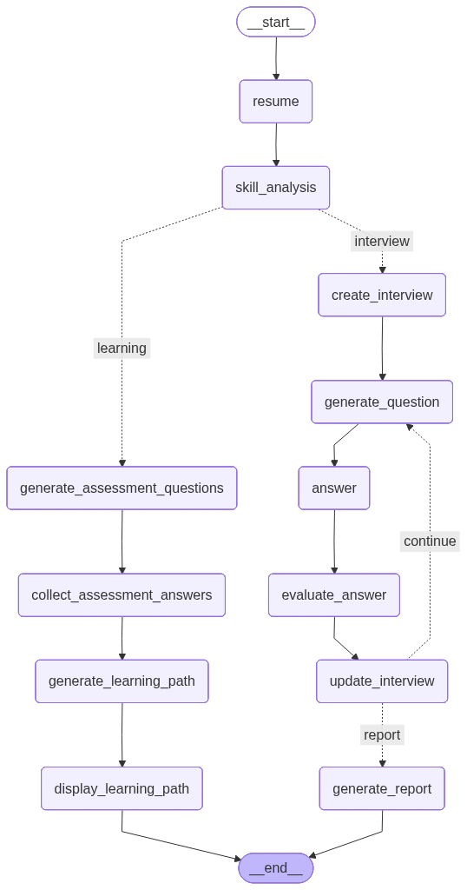

# CareerCopilot

CareerCopilot is an AI-powered career assistant that helps users identify skill gaps, build personalized learning paths, and practice mock interviews — all from a single interface. It was built using LangGraph for multi-agent orchestration and Groq as the LLM backend, with a FastAPI server on the backend and a dark-mode HTML/CSS/JS frontend.

Live demo: [career-copilot-five-red.vercel.app](https://career-copilot-five-red.vercel.app)

---

## What it does

The app takes a user's resume as input and routes them into one of two flows depending on their goal:

**Learning Path** — The agent analyzes the resume, generates a skill assessment to understand where the user currently stands, collects their answers, then produces a structured learning roadmap tailored to the gaps it finds.

**Mock Interview** — The agent creates a session-specific interview, asks questions one at a time, evaluates each answer, and at the end generates a performance report with feedback.

Both flows run as stateful graphs using LangGraph, so each node has full access to the accumulated session state rather than relying on prompt chaining.

---

## Agent Graph

The graph below shows how the two flows branch from a shared entry point and converge back at the end.



The `skill_analysis` node acts as the router — it reads the resume and decides whether to send the user down the `learning` path or the `interview` path based on their input. From there, each branch runs independently until it hits `__end__`.

---

## Tech Stack

| Layer | Technology |
|---|---|
| Agent Framework | LangGraph |
| LLM Provider | Groq (LLaMA 3) |
| Backend | FastAPI (Python) |
| Frontend | HTML, CSS, JavaScript |
| Deployment | Railway (backend), Vercel (frontend) |


## Running Locally

**Prerequisites:** Python 3.10+, a Groq API key

```bash
# Clone the repo
git clone https://github.com/HaiderMaseeh/CareerCopilot.git
cd CareerCopilot
```

**Backend**

```bash
cd backend
pip install -r requirements.txt

# Set your environment variable
export GROQ_API_KEY=your_key_here

uvicorn main:app --reload --port 8000
```

**Frontend**

The frontend is static. Open `frontend/index.html` directly in a browser, or serve it with any static server:

```bash
cd frontend
python -m http.server 3000
```

Then go to `http://localhost:3000`.

---

## How the Graph Works

1. The user uploads or pastes their resume.
2. The `resume` node extracts and structures the content.
3. `skill_analysis` reads the resume and routes to either `learning` or `interview`.
4. In the learning path: assessment questions are generated, answers are collected, and a learning path is produced and displayed.
5. In the interview path: a session is created, questions are asked one at a time, answers are evaluated after each round, and the loop continues until the session ends with a final report.

State is maintained across nodes using LangGraph's `StateGraph`, so each node can read and write to a shared state dict without needing to pass data manually between steps.

---

## Environment Variables

| Variable | Description |
|---|---|
| `GROQ_API_KEY` | Your Groq API key |
| `FRONTEND_URL` | Allowed origin for CORS (set this to your Vercel URL in production) |

---

## Author

Haider Maseeh
[haidermashee9@gmail.com](mailto:haidermashee9@gmail.com)  
[github.com/HaiderMaseeh](https://github.com/HaiderMaseeh)
